Visualizing distributions
========================================================

#### for Nicholas Reich's Statistical Modeling and Data Visualization course at UMass (PUBHLTH 690NR)

Being able to quickly and deftly charaterize univariate and bivariate distributions in a dataset is a crucial step towards understanding any dataset. 

We begin by loading the ggplot2 package, a cutting-edge, actively-developed package that helps create pretty graphics, and the MASS package, which has lots of datasets.

```r
library(ggplot2)
library(MASS)
```


Next, we're going to explore a dataset that is pre-loaded in R, the crabs dataset.

```r
data()  ## look at all the datasets available to you
data(crabs)  ## load the crabs dataset
str(crabs)
```

```
## 'data.frame':	200 obs. of  8 variables:
##  $ sp   : Factor w/ 2 levels "B","O": 1 1 1 1 1 1 1 1 1 1 ...
##  $ sex  : Factor w/ 2 levels "F","M": 2 2 2 2 2 2 2 2 2 2 ...
##  $ index: int  1 2 3 4 5 6 7 8 9 10 ...
##  $ FL   : num  8.1 8.8 9.2 9.6 9.8 10.8 11.1 11.6 11.8 11.8 ...
##  $ RW   : num  6.7 7.7 7.8 7.9 8 9 9.9 9.1 9.6 10.5 ...
##  $ CL   : num  16.1 18.1 19 20.1 20.3 23 23.8 24.5 24.2 25.2 ...
##  $ CW   : num  19 20.8 22.4 23.1 23 26.5 27.1 28.4 27.8 29.3 ...
##  $ BD   : num  7 7.4 7.7 8.2 8.2 9.8 9.8 10.4 9.7 10.3 ...
```

```r
summary(crabs)
```

```
##  sp      sex         index            FL             RW      
##  B:100   F:100   Min.   : 1.0   Min.   : 7.2   Min.   : 6.5  
##  O:100   M:100   1st Qu.:13.0   1st Qu.:12.9   1st Qu.:11.0  
##                  Median :25.5   Median :15.6   Median :12.8  
##                  Mean   :25.5   Mean   :15.6   Mean   :12.7  
##                  3rd Qu.:38.0   3rd Qu.:18.1   3rd Qu.:14.3  
##                  Max.   :50.0   Max.   :23.1   Max.   :20.2  
##        CL             CW             BD      
##  Min.   :14.7   Min.   :17.1   Min.   : 6.1  
##  1st Qu.:27.3   1st Qu.:31.5   1st Qu.:11.4  
##  Median :32.1   Median :36.8   Median :13.9  
##  Mean   :32.1   Mean   :36.4   Mean   :14.0  
##  3rd Qu.:37.2   3rd Qu.:42.0   3rd Qu.:16.6  
##  Max.   :47.6   Max.   :54.6   Max.   :21.6
```


Notice that the 'sp' and 'sex' columns in the crabs dataframe are "Factors". A factor is the name of the data type that R uses for categorical variables. Before we dive into analyzing the data, let's learn a little bit about factors.

```r
table(crabs$sex)
```

```
## 
##   F   M 
## 100 100
```

```r
head(crabs$sex)
```

```
## [1] M M M M M M
## Levels: F M
```

```r
levels(crabs$sex)
```

```
## [1] "F" "M"
```

```r
nlevels(crabs$sex)
```

```
## [1] 2
```

```r
str(crabs)
```

```
## 'data.frame':	200 obs. of  8 variables:
##  $ sp   : Factor w/ 2 levels "B","O": 1 1 1 1 1 1 1 1 1 1 ...
##  $ sex  : Factor w/ 2 levels "F","M": 2 2 2 2 2 2 2 2 2 2 ...
##  $ index: int  1 2 3 4 5 6 7 8 9 10 ...
##  $ FL   : num  8.1 8.8 9.2 9.6 9.8 10.8 11.1 11.6 11.8 11.8 ...
##  $ RW   : num  6.7 7.7 7.8 7.9 8 9 9.9 9.1 9.6 10.5 ...
##  $ CL   : num  16.1 18.1 19 20.1 20.3 23 23.8 24.5 24.2 25.2 ...
##  $ CW   : num  19 20.8 22.4 23.1 23 26.5 27.1 28.4 27.8 29.3 ...
##  $ BD   : num  7 7.4 7.7 8.2 8.2 9.8 9.8 10.4 9.7 10.3 ...
```

```r
crabs$sex <- relevel(crabs$sex, ref = "M")  ## make 'Male' the reference level
str(crabs)  # note the numeric values of $sex have changed
```

```
## 'data.frame':	200 obs. of  8 variables:
##  $ sp   : Factor w/ 2 levels "B","O": 1 1 1 1 1 1 1 1 1 1 ...
##  $ sex  : Factor w/ 2 levels "M","F": 1 1 1 1 1 1 1 1 1 1 ...
##  $ index: int  1 2 3 4 5 6 7 8 9 10 ...
##  $ FL   : num  8.1 8.8 9.2 9.6 9.8 10.8 11.1 11.6 11.8 11.8 ...
##  $ RW   : num  6.7 7.7 7.8 7.9 8 9 9.9 9.1 9.6 10.5 ...
##  $ CL   : num  16.1 18.1 19 20.1 20.3 23 23.8 24.5 24.2 25.2 ...
##  $ CW   : num  19 20.8 22.4 23.1 23 26.5 27.1 28.4 27.8 29.3 ...
##  $ BD   : num  7 7.4 7.7 8.2 8.2 9.8 9.8 10.4 9.7 10.3 ...
```

In general, R will read character columns in an imported dataset in as factors. However, on occasion, you will need to create a factor from scratch.  here is such an example:

```r
f <- c("a", "b", "a", "b", "a", "c")  ## here is a character vector
f.fac <- as.factor(f)  ## we can make it a factor
as.numeric(f.fac)  ## and then if we convert it to numeric you can see the underlying values
```

```
## [1] 1 2 1 2 1 3
```


Here are some univariate explorations of the crabs data.

```r
qplot(CW, data = crabs)
```

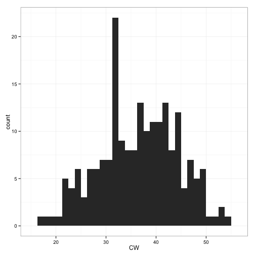 

```r
qplot(CW, data = crabs, geom = "histogram")
```

 

```r

qplot(sp, data = crabs)
```

 

```r
qplot(sp, data = crabs, fill = sex)
```

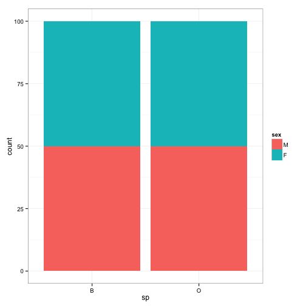 

```r
with(crabs, table(sp, sex))
```

```
##    sex
## sp   M  F
##   B 50 50
##   O 50 50
```


Here is some exploration of continuous by continuous data.

```r
qplot(CW, RW, data = crabs)
```

 

```r
qplot(CW, RW, data = crabs, geom = "point")
```

 

```r
qplot(CW, RW, data = crabs, geom = c("point", "density2d"))
```

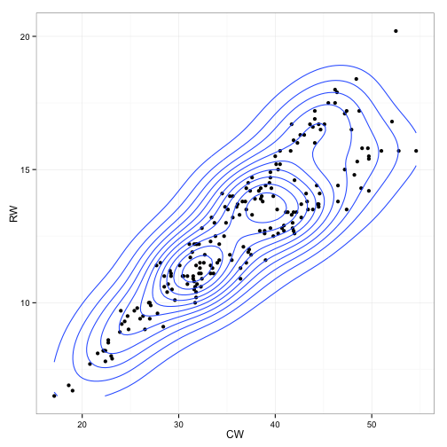 

```r

qplot(CW, RW, data = crabs, color = sex)
```

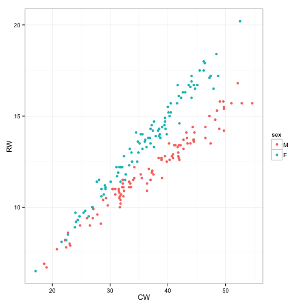 

```r
qplot(CW, RW, data = crabs, color = sp)
```

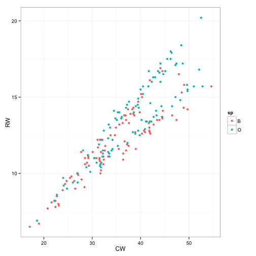 

```r

qplot(CW, FL, data = crabs, color = sex)
```

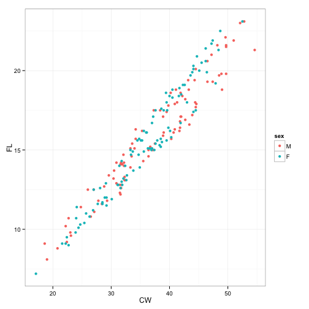 

```r
qplot(CW, FL, data = crabs, color = sp)
```

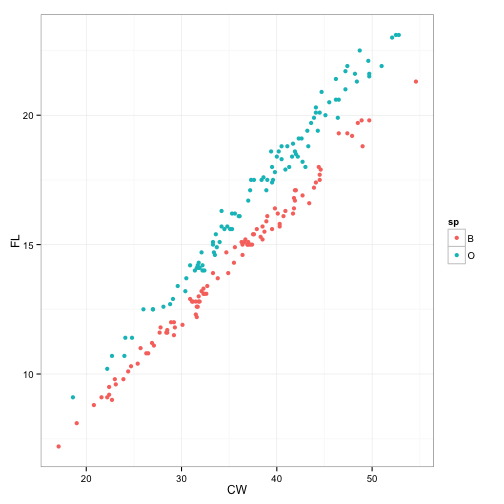 

```r
qplot(CW, FL, data = crabs, color = sp:sex)
```

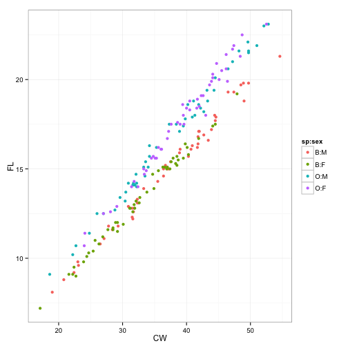 

```r
qplot(CW, FL, data = crabs, facets = . ~ sp)
```

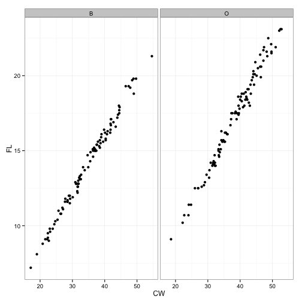 

```r
qplot(CW, FL, data = crabs, facets = . ~ sp, color = sex)
```

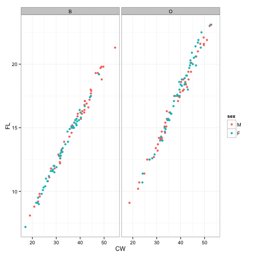 

```r


qplot(CW, RW, data = crabs)
```

 

```r
qplot(CW, RW, data = crabs, geom = c("point"))
```

 

```r
qplot(CW, RW, data = crabs, geom = c("point", "smooth"))
```

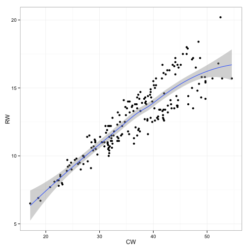 

```r
qplot(CW, RW, data = crabs, geom = c("point", "smooth"), color = sex)
```

 

```r
qplot(CW, RW, data = crabs, geom = c("point", "smooth", "density2d"), color = sex)
```

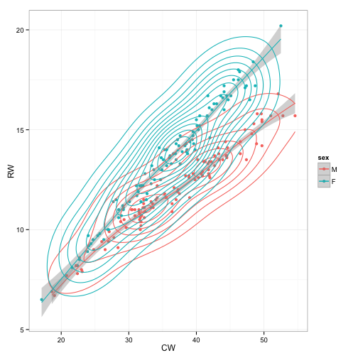 


You can also create interactive graphics using the manipulate() function. Note: these interactive graphs will not show up in the printout of code and graphs.


```r
library(manipulate)
manipulate(qplot(CW, crabs[, x], data = crabs), x = picker("RW", "FL", "CL", 
    "CW", "BD"))
manipulate(qplot(CW, crabs[, x], data = crabs, color = sex), x = picker("RW", 
    "FL", "CL", "BD"))
manipulate(qplot(CW, crabs[, x], data = crabs, color = crabs[, y]), x = picker("RW", 
    "FL", "CL", "BD"), y = picker("sex", "sp"))
manipulate(qplot(CW, crabs[, x], data = crabs, color = crabs[, y]) + xlim(15, 
    xmax), x = picker("RW", "FL", "CL", "BD"), y = picker("sex", "sp"), xmax = slider(25, 
    75))
```


And some categorical by continuous

```r
qplot(sex, CW, data = crabs)
```

 

```r
qplot(sex, CW, data = crabs, geom = "point")
```

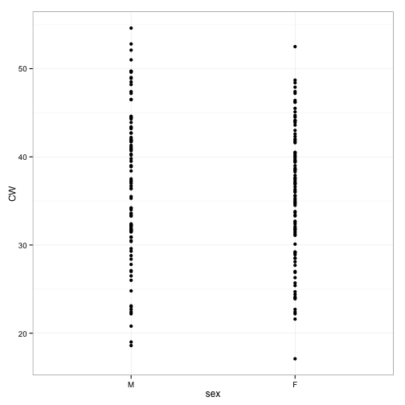 

```r
qplot(sex, CW, data = crabs, geom = "boxplot")
```

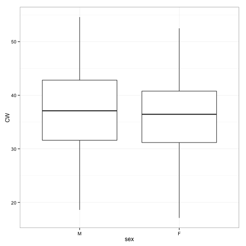 

```r
qplot(sex, CW, data = crabs, geom = "boxplot", facets = . ~ sp)
```

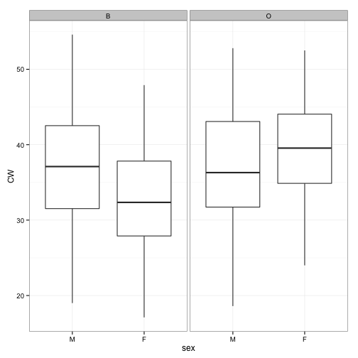 

```r
qplot(sex, CW, data = crabs, geom = "boxplot", facets = sp ~ .)
```

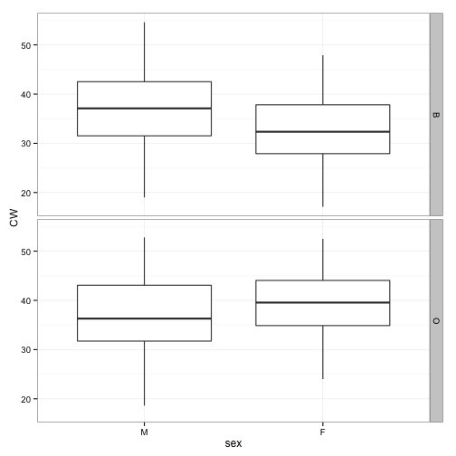 

```r
qplot(sex, CW, data = crabs, geom = "violin")
```

 

```r
qplot(sex, CW, data = crabs, geom = c("violin", "point"))
```

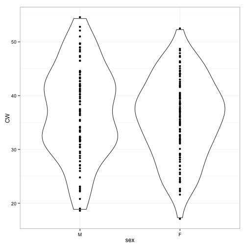 


```r
require(GGally)
head(crabs)
```

```
##   sp sex index   FL  RW   CL   CW  BD
## 1  B   M     1  8.1 6.7 16.1 19.0 7.0
## 2  B   M     2  8.8 7.7 18.1 20.8 7.4
## 3  B   M     3  9.2 7.8 19.0 22.4 7.7
## 4  B   M     4  9.6 7.9 20.1 23.1 8.2
## 5  B   M     5  9.8 8.0 20.3 23.0 8.2
## 6  B   M     6 10.8 9.0 23.0 26.5 9.8
```

```r
crabs.mat <- crabs[, 4:8]
ggpairs(crabs.mat)
```

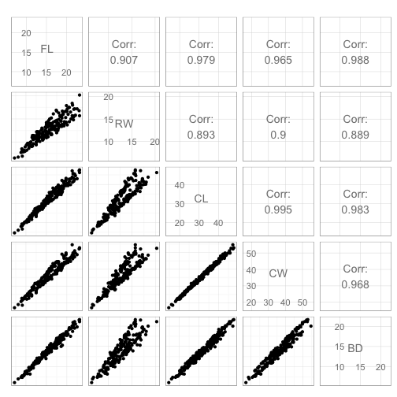 


```r
sessionInfo()
```

```
## R version 3.0.2 (2013-09-25)
## Platform: x86_64-apple-darwin10.8.0 (64-bit)
## 
## locale:
## [1] en_US.UTF-8/en_US.UTF-8/en_US.UTF-8/C/en_US.UTF-8/en_US.UTF-8
## 
## attached base packages:
## [1] graphics  grDevices utils     datasets  stats     methods   base     
## 
## other attached packages:
## [1] GGally_0.4.5    reshape_0.8.4   plyr_1.8        MASS_7.3-29    
## [5] knitr_1.5       ggplot2_0.9.3.1
## 
## loaded via a namespace (and not attached):
##  [1] colorspace_1.2-4   dichromat_2.0-0    digest_0.6.4      
##  [4] evaluate_0.5.1     formatR_0.10       grid_3.0.2        
##  [7] gtable_0.1.2       labeling_0.2       munsell_0.4.2     
## [10] proto_0.3-10       RColorBrewer_1.0-5 reshape2_1.2.2    
## [13] scales_0.2.3       stringr_0.6.2      tools_3.0.2
```

